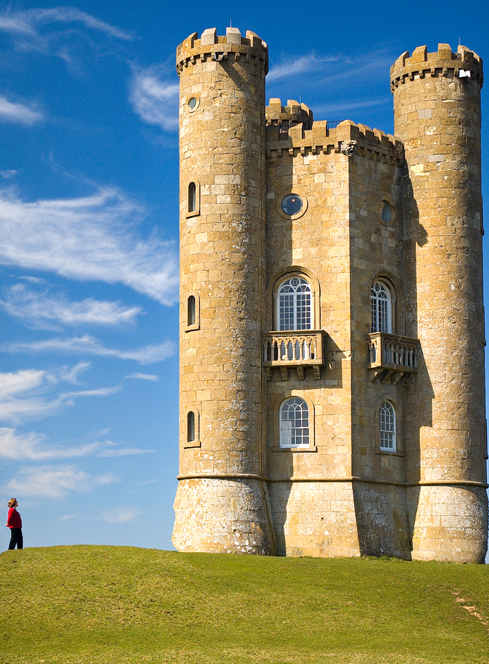

# Seams Okay

A tiny seam carving implementation that shrinks images by intelligently removing vertical seams instead of just cropping.

inspired by [this tsoding video](https://www.youtube.com/watch?v=zrduCu8LYUM).

learn more: [seam carving on wikipedia](https://en.wikipedia.org/wiki/Seam_carving)

## quick start

```bash
./run.sh image.jpg <num_seams>
```

converts your image to ppm, carves out seams, and saves the result as png.

## demo

removed 714 seams (50% of width) from a broadway tower image:

**before:**


**after:**


